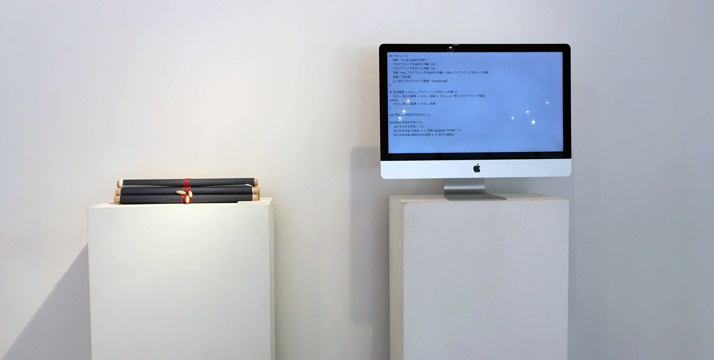

# ＊ as Code (Aster as Code)

JavaScript で記述したソースコードを和紙に印刷して、学内応接室に配置した作品。  
およそ 100 行のソースコードを縦の巻物として仕上げることで、モニタと同じ縦スクロールのような視線の誘導を試みた。

## 材料

- [アワガミ インクジェットペーパー](http://www.awagami.jp/products/aijp/index.html#kozo02)
- [和紙糊 - ヤマト](https://www.yamato.co.jp/products/I00000008/)
- ECMAScript 2015

## 展示

- 「あしたをプロトタイピングする」展
  - http://www.ilas.nagoya-u.ac.jp/clas/programs/375.php
- インタラクション 2019
  - http://www.interaction-ipsj.org/proceedings/2019/data/bib/1A-08.html
