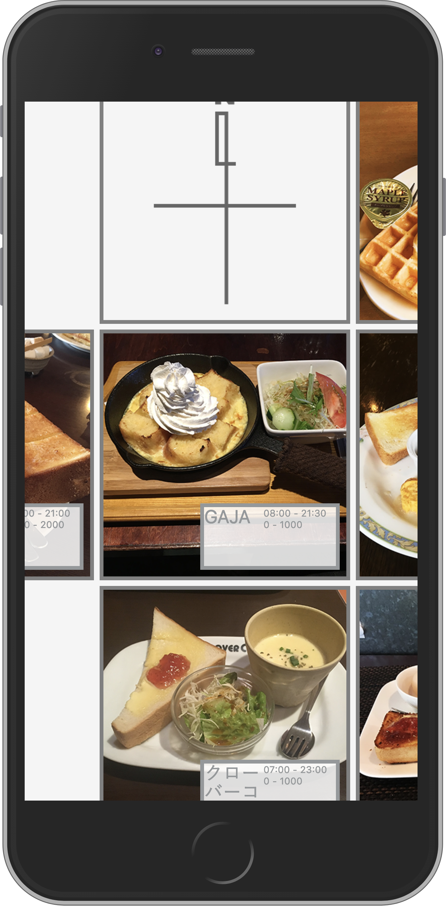
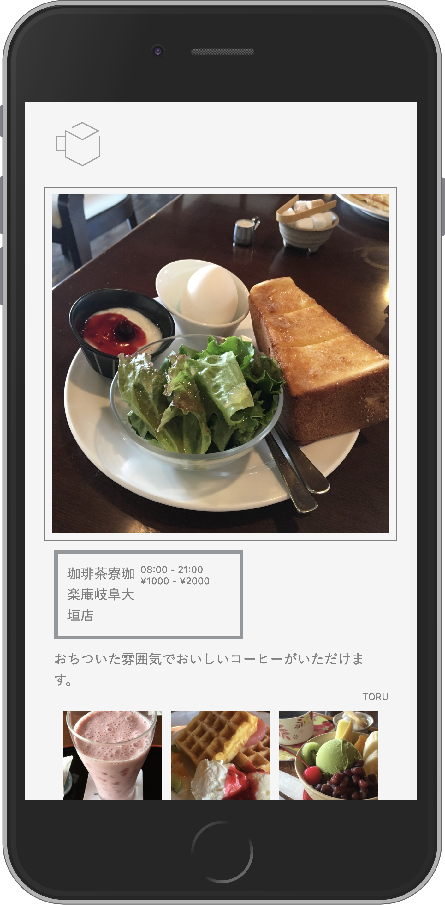

# Morning Square

岐阜県大垣市付近のオススメの「モーニング」が楽しめる喫茶店を、街を探検するような感覚で探すことのできる web アプリケーション。  
東海地方では専ら高齢者に広く使われているサービスとなった喫茶店のモーニングをスマホの特性を生かした操作で探すことができる。

## 共同制作

- UI/UX & Concept Design: Hiromu Ehara

## 公開 URL

- [https://morning-sq.v.nasustim.com](https://morning-sq.v.nasustim.com)

## 技術要素

- サーバサイド
  - Express(Node.js)
- フロントエンド
  - jQuery
  - Lightbox
- インフラ
  - Nginx
  - Docker Compose
  - SQLite3

