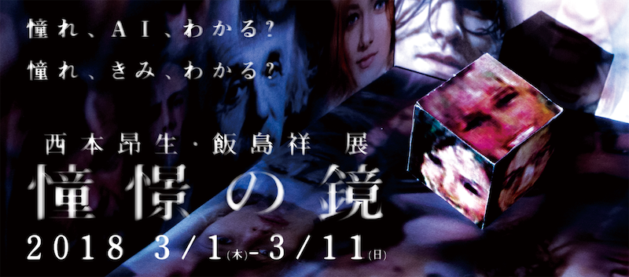

# 憧憬の鏡 - テクニカルサポート

大学院同期の西本昂生, 飯島祥によるメディアアート作品、《憧憬の鏡》の制作へのテクニカルサポート。  
この作品は機械学習モデルの一つである DCGAN を用いて鑑賞者の憧れの顔を顕にすることを試みた作品です。  
私は学習データのファイル操作などを行うユーティリティ部分のプログラミングを行いました。

")

## 展示

- [E&Cギャラリー(福井県福井市) - 2018年3月](http://www.iamas.ac.jp/activity/shokei-no-kagami)

## 企画 / 制作

- [Koki Nishimoto](https://nishimoto-koki.tumblr.com)
- [Sho Iijima](https://shoiijima.github.io)
