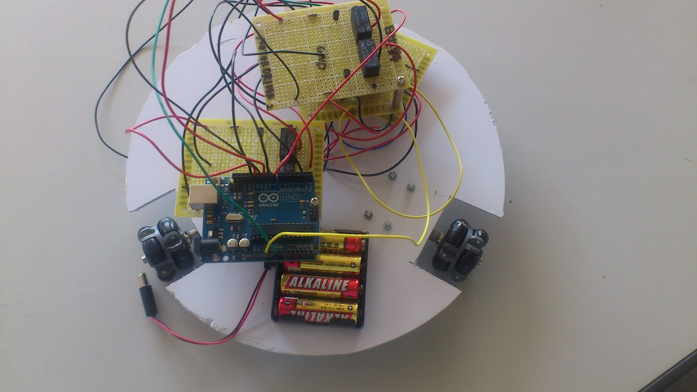
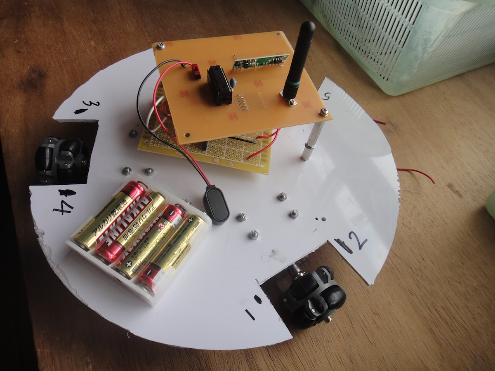
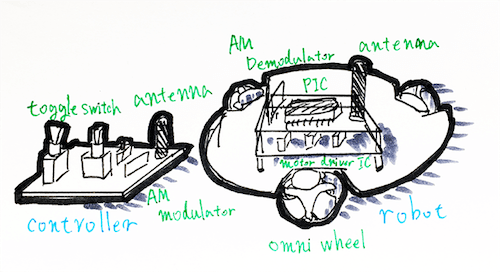

# オムニホイールラジコンカー

PIC16F84A と AM 変調/復調モジュール、オムニホイールを用いた、車体の向きを変えず 8 方向に移動することのできるラジコンカー。  
PIC マイコンによる PWM 制御でモータ一つ一つに流れる電圧の実効値を変化させ、正確な制御を実現した。

<!---->

## 技術要素

- マイコン
  - Microchip PIC 16F84A
- プログラミング
  - C (CCS C Compiler)
- Communicate
  - 自作プロトコル
