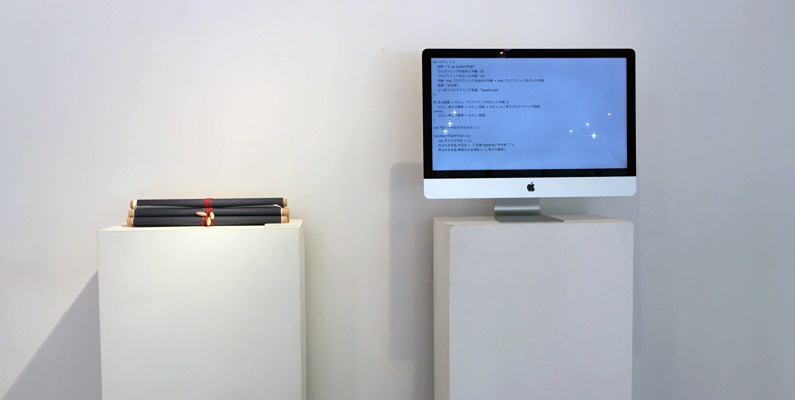

# ＊ as Code (Aster as Code)


JavaScriptで記述したソースコードを和紙に印刷して、学内応接室に配置した作品。

およそ100行のソースコードを縦の巻物として仕上げることで、モニタと同じ縦スクロールのような視線の誘導を試みた。




## 材料

- [アワガミ インクジェットペーパー](http://www.awagami.jp/products/aijp/index.html#kozo02)
- [和紙糊 - ヤマト](https://www.yamato.co.jp/products/I00000008/)
- ECMAScript 2015

## 展示

- 「あしたをプロトタイピングする」展
    - http://www.ilas.nagoya-u.ac.jp/clas/programs/375.php
- インタラクション2019
    - https://www.interaction-ipsj.org/2019/
    - http://www.interaction-ipsj.org/proceedings/2019/data/bib/1A-08.html

---------------

```javascript
class 人間{
    constructor(){
        this.誤差 = 90;
        this.フィードバック;
        this.理想の具合 = ( x ) => 
            x;
        this.伝わり具合 = ( x ) => 
            this.誤差 / 100 * x;
    }
    受け入れる(){
        this.誤差 = 
            this.誤差 + 
                (100 - this.フィードバック * 100) / 人数;
    }
    諦める(){
        this.誤差 = 
            this.誤差 - this.フィードバック * 100 / 人数;
    }
}
var 人間たち = [];
var 人数 = 8000000000;
for( var i = 0; i < 人数; i++ ){
    人間たち[ i ] = new 人間();
}
var わたし = new 人間();
for( var i = 0; i < 人数; i++ ){
    for( var j = i + 1; j <= 人数; j++ ){
        var コミュニケーション;
        if( j == 人数 + 1 ){
            コミュニケーション = ( x ) => 
                わたし.伝わり具合( x ) 
                    / 人間たち[ i ].理想の具合( x );
            わたし.フィードバック =　
                コミュニケーション(100);
            わたし.諦める();
        }else{
            コミュニケーション = ( x ) => 
                人間たち[ j ].伝わり具合( x ) 
                    / 人間たち[ i ].理想の具合( x );
            人間たち[ j ].フィードバック =　
                コミュニケーション(100);
            人間たち[ j ].受け入れる();
        }
    }
}
```