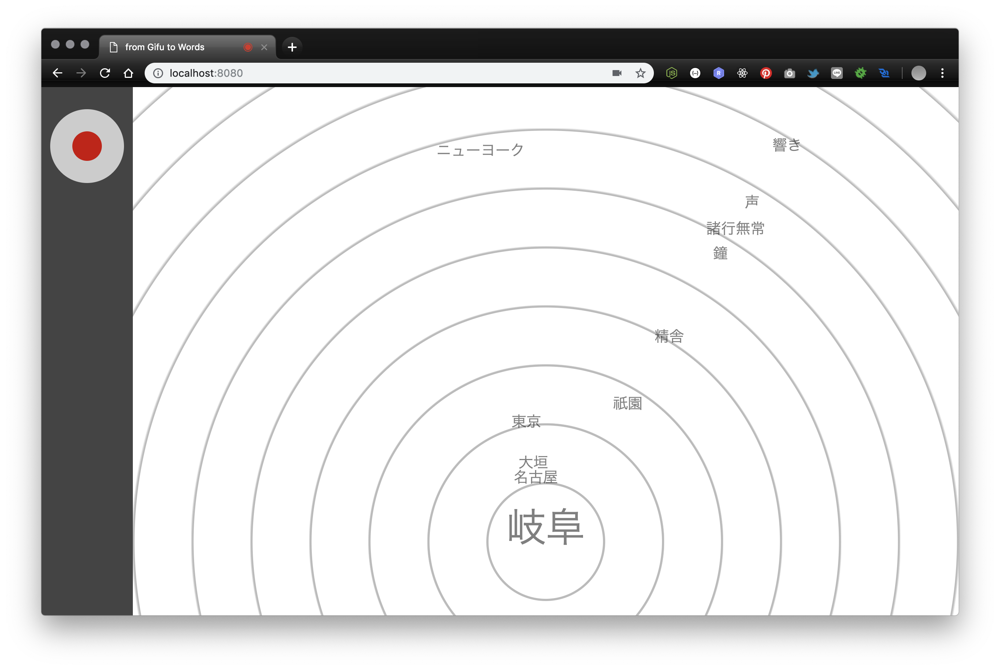

# from Gifu to words

この作品は、人の話す言葉同士の関係に興味を持ち、それらを距離として顕にすることを試みた作品です。  
コンピュータの側にあるマイクに話しかけると Web Speech API を介してその音声が文字情報化され、
バックエンドの HTTP サーバの中で形態素解析され、
word2vec[^1]を用いて"岐阜"と一つ一つの単語との意味的な距離をビジュアライズされます。  
IAMAS オープンハウス 2017 で展示を行いました。

[^1]: 株式会社白ヤギコーポレーション様が公開されているコーパスを使用させていただきました

## Thanks

- コーパス
  - [word2vec の学習済み日本語モデルを公開します | カメリオ開発者ブログ](http://aial.shiroyagi.co.jp/2017/02/japanese-word2vec-model-builder)[^1]

## 技術要素

### フロントエンド

- データバインド
  - D3.js
- 音声認識
  - Web Speech API(Google Chrome)

### バックエンド

- Web アプリケーションフレームワーク
  - Express(Node.js)
- 形態素解析
  - kuromoji.js
- 各単語の意味解析
  - word2vec(Gensim)
