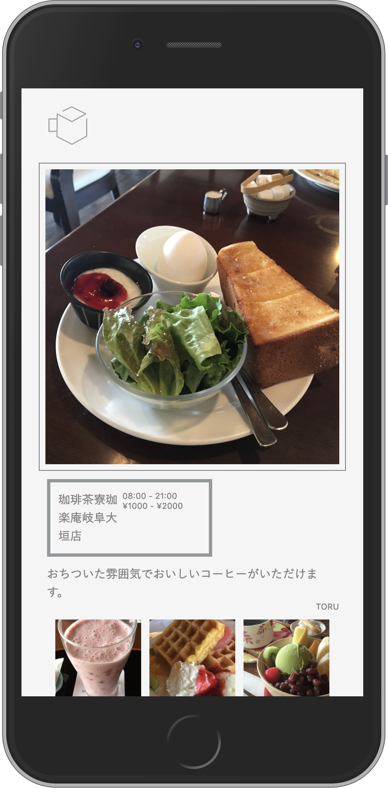

# Morning Square

岐阜県大垣市付近のオススメの「モーニング」が楽しめる喫茶店を、街を探検するような感覚で探すことのできるwebアプリケーション。

東海地方では専ら高齢者に広く使われているサービスとなった喫茶店のモーニングをスマホの特性を生かした操作で探すことができる。

## 共同制作

- UI/UX & コンセプトデザイン
    - [Hiromu Ehara](https://hehara17.myportfolio.com)

## 公開URL
- https://morning-sq.v.nasustim.com

## 技術要素

### バックエンド
- サーバ内でのプロキシ
    - Nginx
- Webアプリケーションフレームワーク
    - Express(Node.js)
### フロントエンド
- DOMの操作
    - jQuery
- 画像表示機能
    - Lightbox
### インフラ
- 仮想環境
    - Docker Compose
- データベース
    - SQLite3

----------

----------