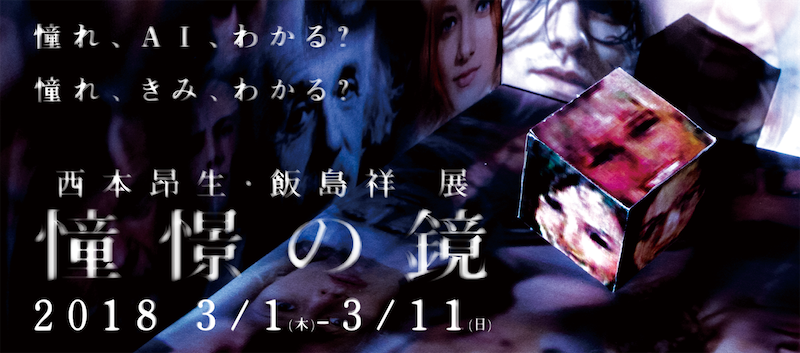

# 憧憬の鏡 - テクニカルサポート

大学院同期の西本昂生, 飯島祥によるメディアアート作品、《憧憬の鏡》の制作へのテクニカルサポート。

この作品は機械学習モデルの一つであるDCGANを用いて鑑賞者の憧れの顔を顕にすることを試みた作品です。
私は学習データのファイル操作などを行うユーティリティ部分のプログラミングを行いました。

")

## Exhibition

- 憧憬の鏡
  - http://www.iamas.ac.jp/activity/shokei-no-kagami

## Co-Create

- Koki Nishimoto
  - https://nishimoto-koki.tumblr.com
- Sho Iijima
  - https://shoiijima.github.io

## Works

- Make data-sets by OpenCV