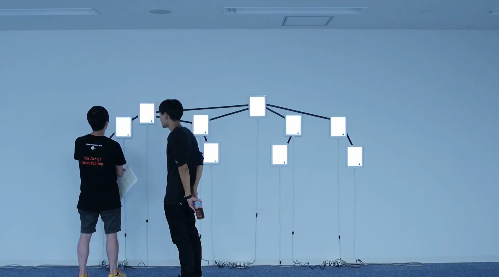
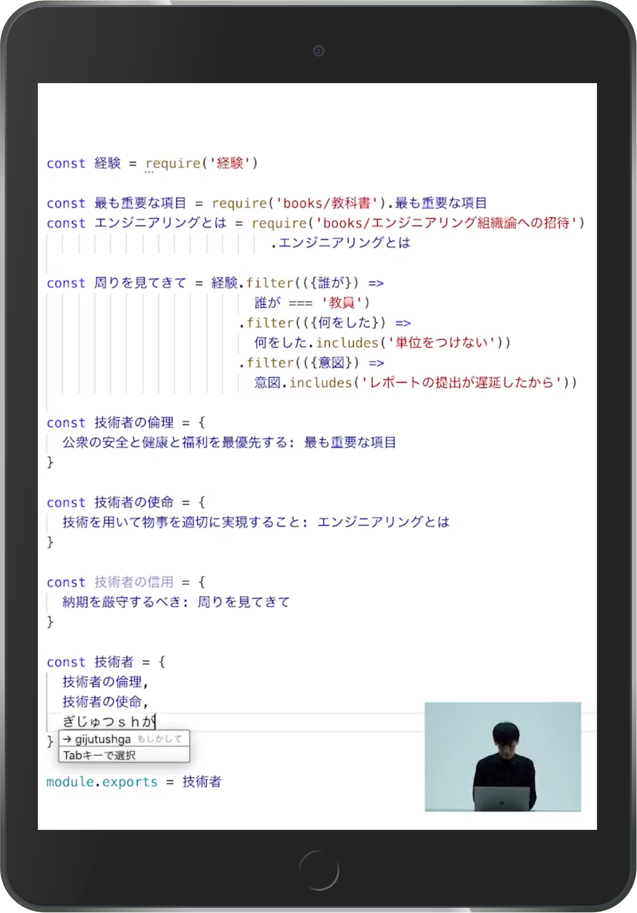
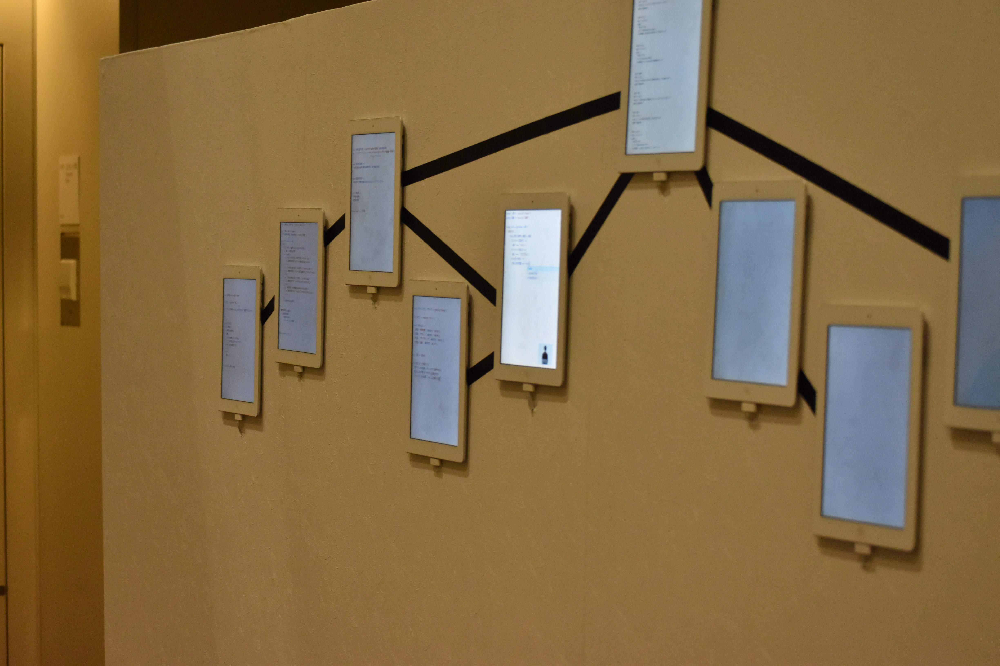

# /module/Whom

プログラミング言語の一つであるJavaScriptを用いて自分自身の考えを記述し、また映像や声といったメディアの特性を用いてJavaScriptやそれに似た言語を読むことのできる人のみではなく、より多くの鑑賞者にソースコードというメディアを通じて自身の考えを伝えることを試みた作品です。

## Systems to Exhibit

- Client
    - https://github.com/nasustim/code-player-module-whom
- Server
    - https://github.com/nasustim/code-server-module-whom

## Exhibition

- IAMAS2020 Graduation and Project Research Exhibition
    - https://www.iamas.ac.jp/exhibit20/

-------

<iframe width="560" height="315" src="https://www.youtube.com/embed/0Nxng8d4PN4" frameborder="0" allow="accelerometer; autoplay; encrypted-media; gyroscope; picture-in-picture" allowfullscreen></iframe>
